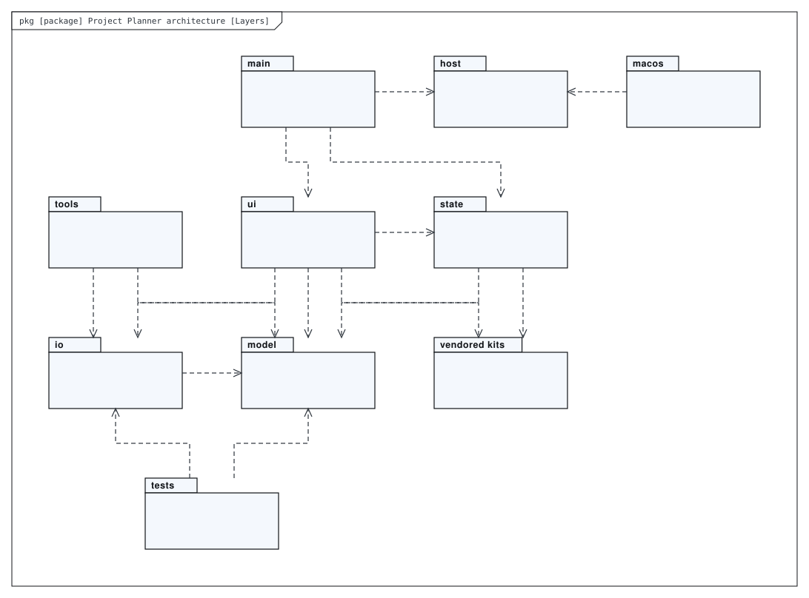
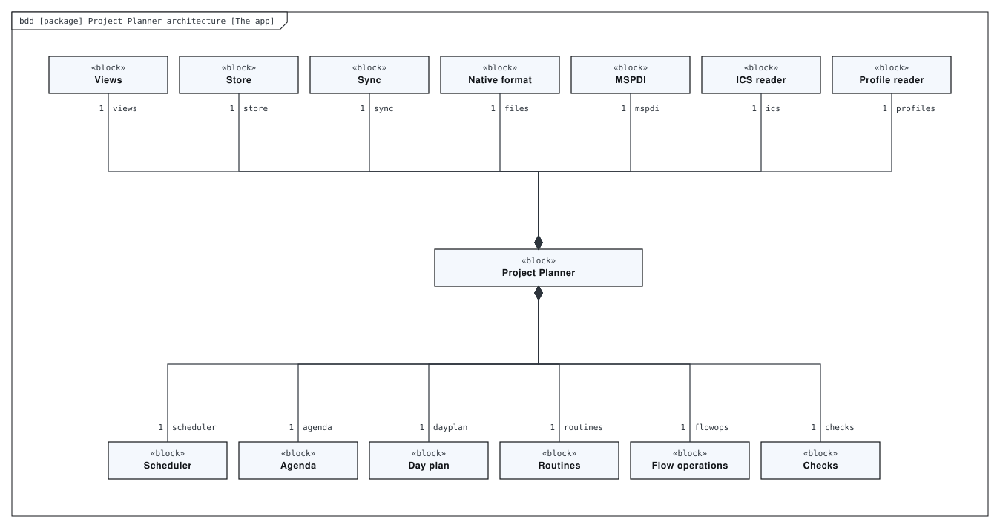
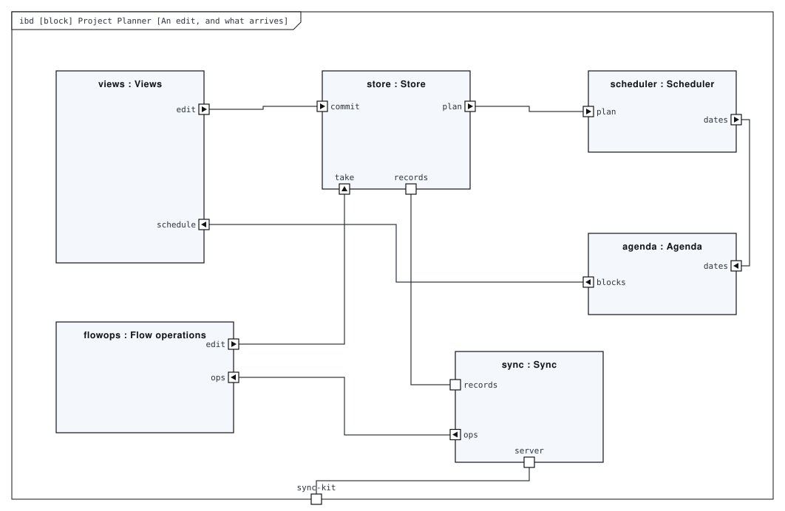
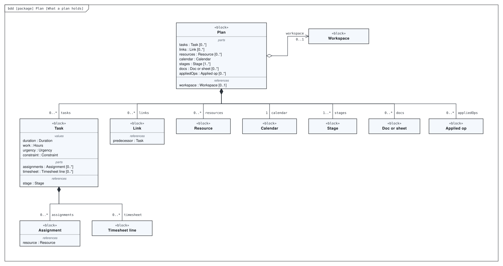
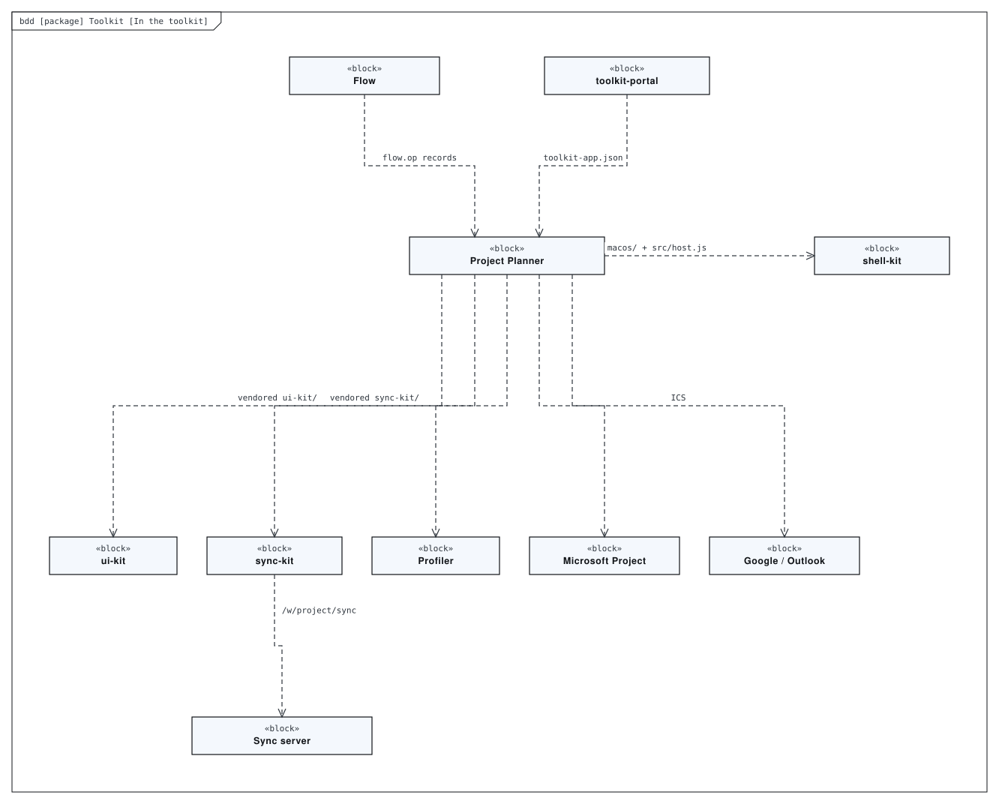
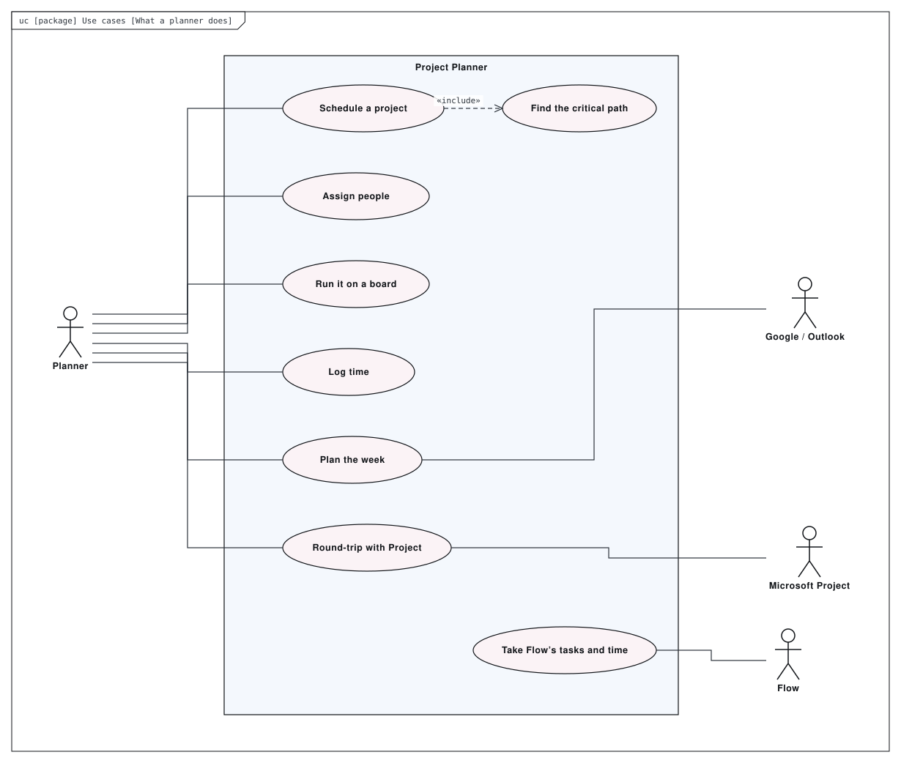
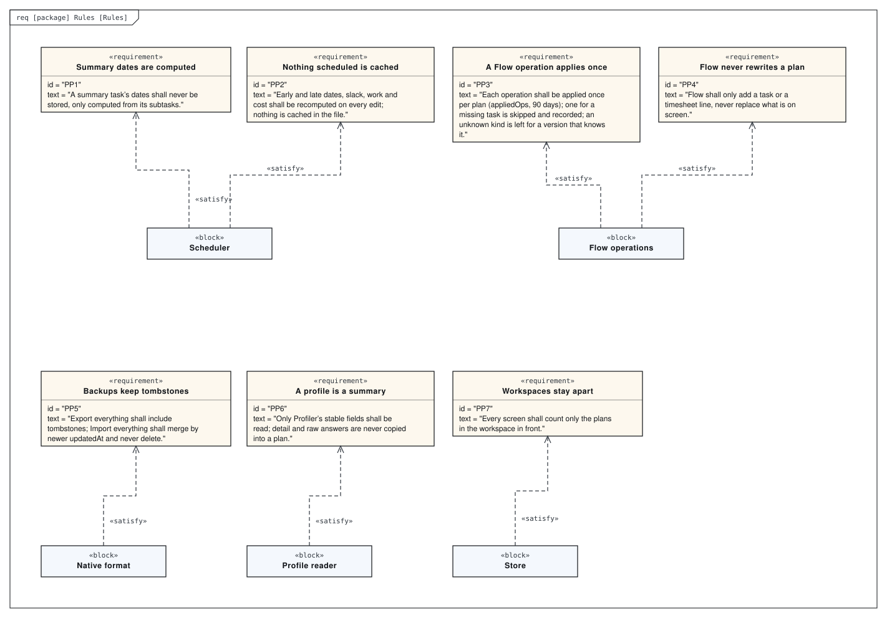

# Architecture

A project scheduler in the manner of Microsoft Project — task list with outline levels, Gantt with the critical path, network diagram, resources — grown a calendar that commits hours around real meetings, people with Profiler summaries, stages and timesheets, and a Flow inbox. No build step: `model/` schedules (CPM, recomputed on every edit), `state/` owns edits and sync, `ui/` draws. Plans sync as records in the `project` workspace, which Flow shares through write-once operations.

This directory holds a SysML model of the repository, made with [SysML Modeler](https://github.com/allenxhsu/sysml-modeler).
`architecture.sysml.json` is the source: open it with **File ▸ Open** in the modeler to edit it, and re-export the SVGs from there.
The SVGs below are exports of it. The model passes the modeler's checks with 0 errors and 0 warnings.

## Layers

*Package diagram* of **Project Planner architecture**.

## The app

*Block definition diagram* of **Project Planner architecture**.

## An edit, and what arrives

*Internal block diagram* of **Project Planner**. No build step, no dependencies. :8125 locally, /project/ on the Portal, a Mac app on shell-kit.

## What a plan holds

*Block definition diagram* of **Plan**. What a *.project.json holds.

## In the toolkit

*Block definition diagram* of **Toolkit**.

## What a planner does

*Use case diagram* of **Use cases**.

## Rules

*Requirement diagram* of **Rules**. What the README promises about schedules, data and the apps it shares a workspace with.

## Generated views

Computed from the model each time it is opened in the modeler:

- **Rules, as a table** — requirement table
- **What verifies which rule** — dependency matrix
